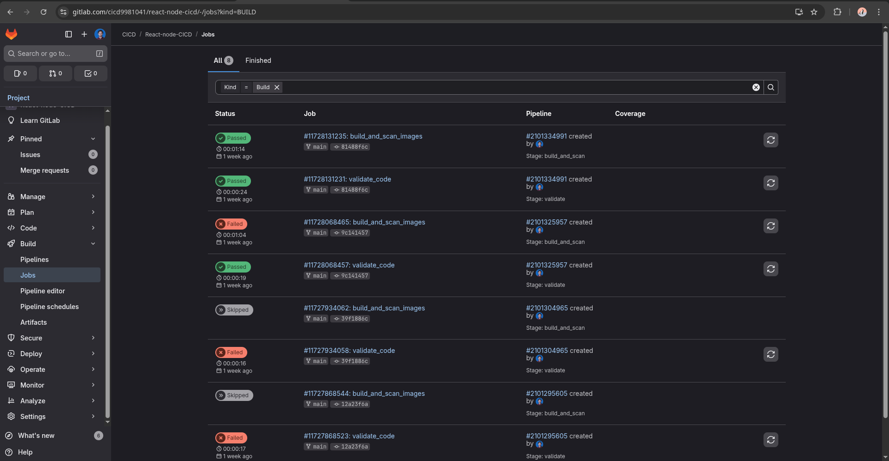

# Full-Stack CI Pipeline with Security Scanning

A two-tier web application (React frontend + Node.js backend) with automated GitLab CI/CD pipeline featuring Docker containerization, multi-stage builds, and Trivy security scanning.


*Pipeline runs showing automated security scanning with Trivy - includes both passed and failed builds during iterative development*

## 🎯 Project Overview

This project demonstrates a production-ready CI/CD workflow that:
- Validates code dependencies with deterministic `npm ci` installs
- Builds optimized Docker images using multi-stage builds
- Scans container images for security vulnerabilities using Trivy
- Fails pipeline on HIGH/CRITICAL security findings
- Tags images with commit SHA for version traceability

## 🛠️ Tech Stack

**Frontend:** React, Vite, Nginx  
**Backend:** Node.js, Express  
**CI/CD:** GitLab CI, Docker-in-Docker  
**Security:** Trivy vulnerability scanner  
**Containerization:** Docker, Docker Compose

## 📊 Performance Metrics

- **Pipeline Duration:** 1 minute 38 seconds (full build + scan)
- **Image Optimization:** 60% size reduction (multi-stage build with Nginx vs Node.js)
- **Security Gate:** Zero HIGH/CRITICAL vulnerabilities across all passing builds
- **Build Traceability:** Commit SHA-based image tagging

## 🚀 Quick Start

### Prerequisites

- Docker and Docker Compose installed
- GitLab account (for CI/CD)
- Node.js 18+ (for local development)

### Local Development

```bash
# Clone the repository
git clone https://gitlab.com/cicd9981041/react-node-cicd
cd react-node-cicd

# Start backend
cd backend
npm install
npm start

# Start frontend (in new terminal)
cd frontend/vite-project
npm install
npm run dev
```

### Run with Docker Compose

```bash
# Build and start all services
docker-compose up --build

# Frontend: http://localhost:5173
# Backend: http://localhost:3000
```

## 🔄 CI/CD Pipeline

The GitLab CI pipeline runs two stages on every commit:

### Stage 1: Validate
- Installs dependencies using `npm ci` (deterministic builds)
- Validates both frontend and backend code

### Stage 2: Build & Scan
- Builds Docker images using Docker-in-Docker
- Tags images with commit SHA for traceability
- Scans images with Trivy for vulnerabilities
- **Fails pipeline if HIGH/CRITICAL issues found**

## 🐳 Docker Optimization

### Multi-Stage Frontend Build

The frontend Dockerfile uses multi-stage builds to:
1. Build the React app with Node.js
2. Serve static files with lightweight Nginx

**Result:** 60% image size reduction compared to serving with Node.js

## 🔒 Security Scanning

Trivy scans all built images for:
- Known CVEs in base images
- Vulnerable dependencies
- Outdated packages

**Quality Gate:** Pipeline fails if any HIGH or CRITICAL vulnerabilities are detected, preventing insecure images from being deployed.

## 📁 Project Structure

```
.
├── .gitlab-ci.yml          # CI/CD pipeline configuration
├── docker-compose.yml      # Multi-container orchestration
├── README.md
├── backend/
│   ├── Dockerfile
│   ├── package.json
│   └── src/
└── frontend/
    └── vite-project/
        ├── Dockerfile       # Multi-stage build
        ├── package.json
        └── src/
```

## 🎓 Key Learnings

- **npm ci vs npm install:** Using `npm ci` in CI ensures reproducible builds from package-lock.json
- **Multi-stage builds:** Reduced production image size by 60% while keeping build tooling separate
- **Security gates:** Automated vulnerability scanning catches issues before deployment
- **DinD configuration:** Properly configured Docker-in-Docker for reliable GitLab CI builds
- **Commit traceability:** SHA-based tagging enables tracking builds back to source code


## 🔗 Resources

- [GitLab CI Documentation](https://docs.gitlab.com/ee/ci/)
- [Trivy Security Scanner](https://trivy.dev/)
- [Docker Multi-Stage Builds](https://docs.docker.com/build/building/multi-stage/)
- [npm ci vs npm install](https://docs.npmjs.com/cli/ci)
